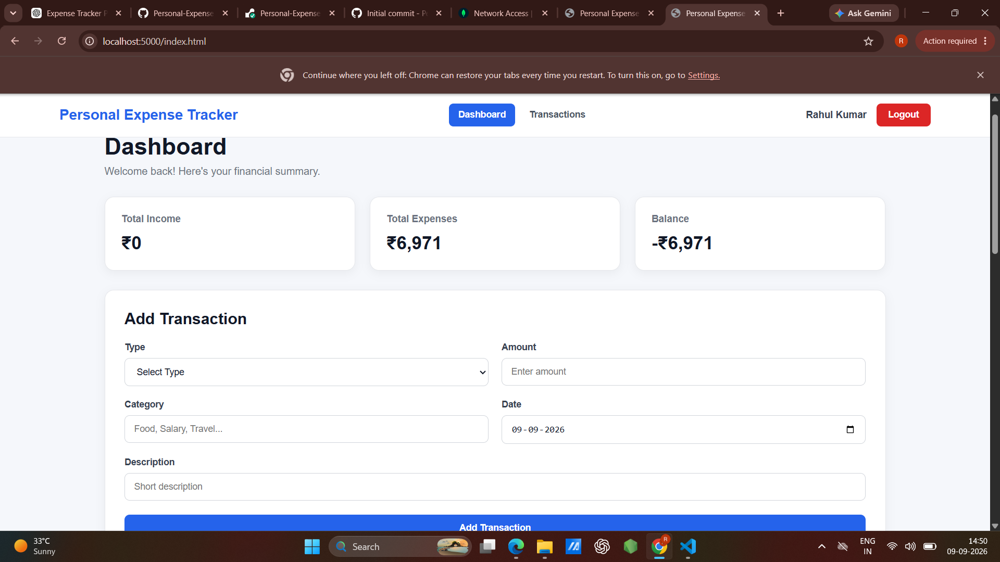
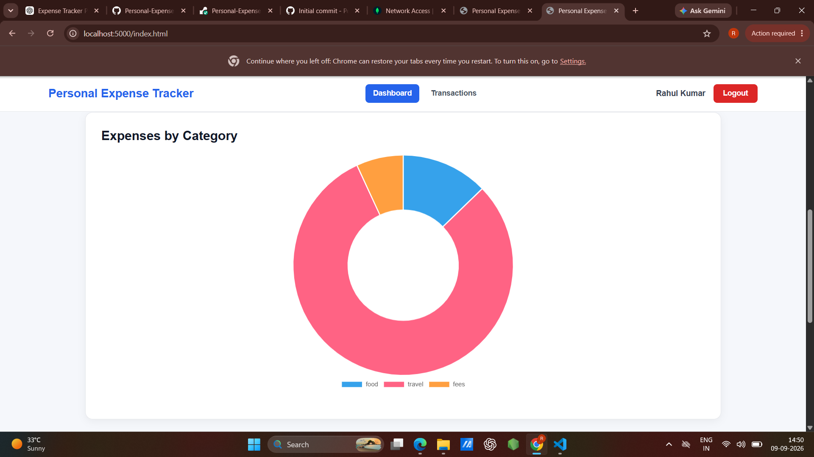
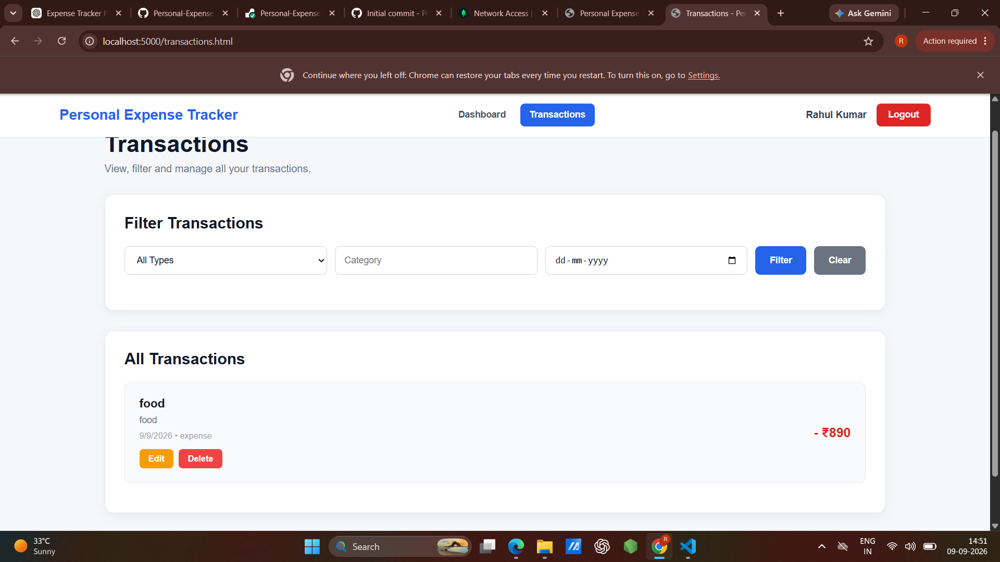

 # 💰 Personal Expense Tracker

A full-stack web application for managing personal income and expenses easily and securely.

## 🚀 Live Demo

**Live Website:**  
https://personal-expense-tracker-15rx.onrender.com

## 📌 Features

- 🔐 User Registration
- 🔑 User Login & Authentication
- 🔒 Secure Password Hashing
- 🎫 JWT Authentication
- 💰 Add Income
- 💸 Add Expenses
- 🏷️ Categorize Transactions
- 📅 Select Transaction Date
- 📝 Add Transaction Description
- 📊 Dashboard Financial Summary
- 💵 Total Income Calculation
- 💳 Total Expense Calculation
- 🧮 Balance Calculation
- 📈 Expense Chart
- 📋 View All Transactions
- 🔍 Filter Transactions
- ✏️ Edit Transactions
- 🗑️ Delete Transactions
- 📱 Responsive Design

## 🛠️ Technologies Used

### Frontend

- HTML5
- CSS3
- JavaScript
- Chart.js

### Backend

- Node.js
- Express.js
- MongoDB
- Mongoose
- JWT
- bcryptjs
- CORS
- dotenv

### Deployment

- GitHub
- Render
- MongoDB Atlas

## 📂 Project Structure

```text
Personal-Expense-Tracker/
│
├── backend/
│   ├── middleware/
│   │   └── authMiddleware.js
│   │
│   ├── models/
│   │   ├── User.js
│   │   └── Transaction.js
│   │
│   ├── routes/
│   │   ├── authRoutes.js
│   │   └── transactionRoutes.js
│   │
│   ├── .env
│   ├── package.json
│   ├── package-lock.json
│   └── server.js
│
├── frontend/
│   ├── css/
│   │   └── style.css
│   │
│   ├── js/
│   │   ├── auth.js
│   │   ├── dashboard.js
│   │   └── transactions.js
│   │
│   ├── index.html
│   ├── login.html
│   ├── register.html
│   └── transactions.html
│
├── screenshots/
│   ├── dashboard-top.png
│   ├── dashboard-middle.png
│   └── dashboard-bottom.png
│
├── .gitignore
└── README.md
```

## 📸 Screenshots

### Dashboard - Top



### Dashboard - Middle



### Dashboard - Bottom



## ⚙️ Local Setup

### 1. Clone the Repository

```bash
git clone https://github.com/rahulraj2007k-pixel/Personal-Expense-Tracker.git
```

### 2. Open the Project

```bash
cd Personal-Expense-Tracker
```

### 3. Install Backend Dependencies

```bash
npm install --prefix backend
```

> If PowerShell blocks `npm`, use `npm.cmd install --prefix backend`.

### 4. Configure Environment Variables

Create the following file:

```text
backend/.env
```

Add:

```env
MONGO_URI=your_mongodb_connection_string
JWT_SECRET=your_secret_key
PORT=5000
```

### 5. Start the Backend Server

```bash
node backend/server.js
```

### 6. Open the Application

Open your browser and visit:

```text
http://localhost:5000
```

## 🔐 Security

- Passwords are securely hashed using bcryptjs.
- JWT is used for user authentication.
- Environment variables are stored in `.env`.
- `.env` is excluded from Git using `.gitignore`.
- Database credentials are not stored in the source code.

## 🌐 Deployment

The application is deployed using:

- **Frontend & Backend:** Render
- **Database:** MongoDB Atlas
- **Source Code:** GitHub

## 👨‍💻 Author

**Rahul Kumar**

### Personal Expense Tracker

Full Stack Web Development Project